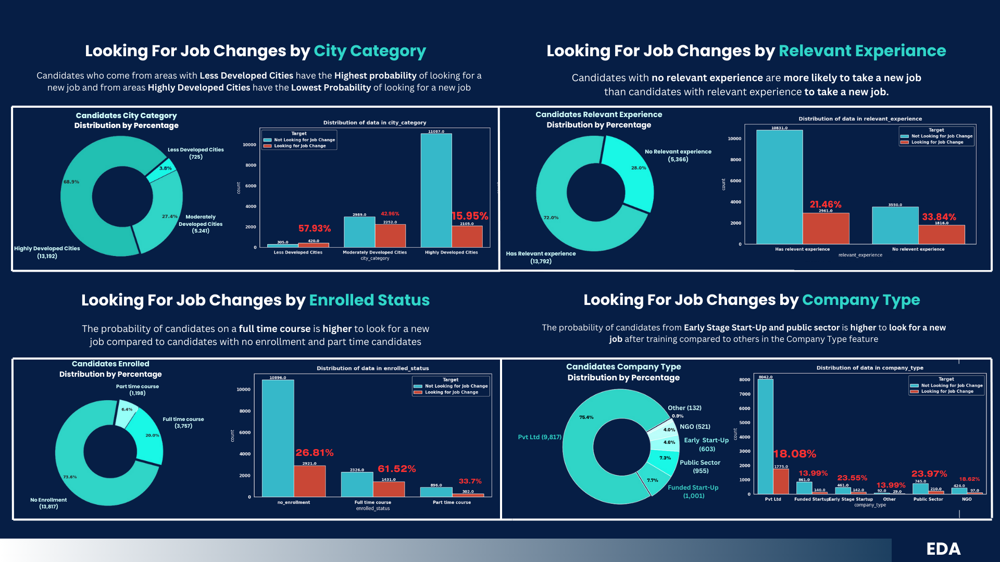
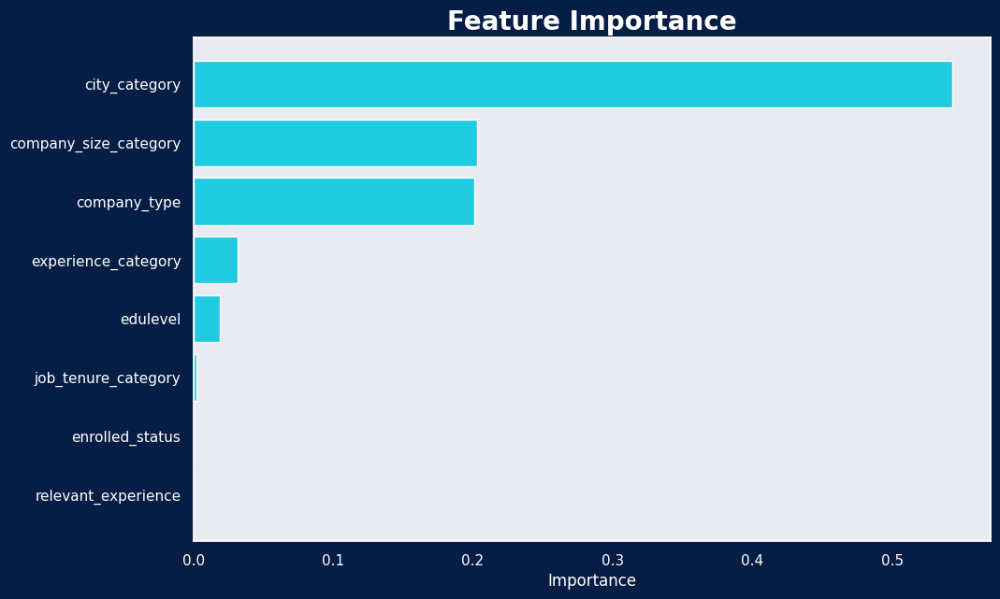
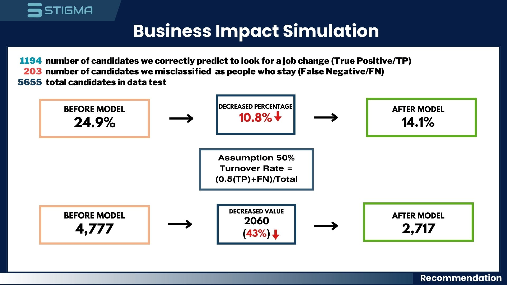
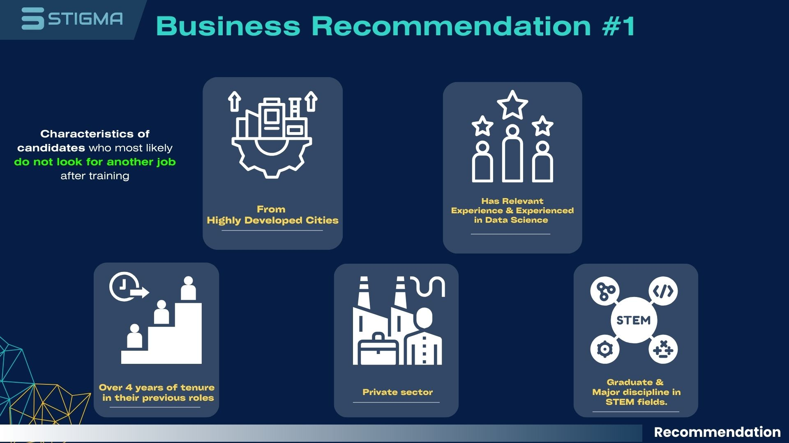
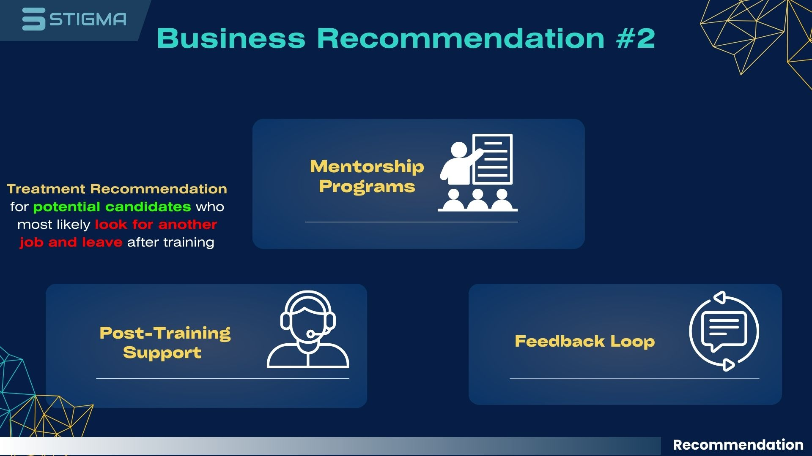

# FINAL PROJECT STIGMA

The HR Analytics Job Change of Data Scientists dataset utilized in this Final Project was obtained from Kaggle. 
<br>Dataset's Link : https://www.kaggle.com/datasets/arashnic/hr-analytics-job-change-of-data-scientists/data

## 📚 Installation

This project requires Python and the following Python libraries installed:

- NumPy
- Pandas
- Matplotlib
- Seaborn
- Scipy
- Sklearn
- Imbalanced-learn

If you don't have Python installed yet, it's recommended that you install [the Anaconda distribution](https://www.anaconda.com/distribution/) of Python, which already has the above packages and more included.

To install the Python libraries, you can use pip:

```bash
pip install numpy pandas matplotlib seaborn scipy sklearn imbalanced-learn
```
To run the Jupyter notebook, you also need to have Jupyter installed. If you installed Python using Anaconda, you already have Jupyter installed. If not, you can install it using pip:
```bash
pip install jupyter
```

Once you have Python and the necessary libraries, you can run the project using Jupyter Notebook:
```bash
jupyter notebook Final_Project_STIGMA.ipynb
```
## 📝 Usage/Examples

To use this project, you need to run the `Final_Project_STIGMA.ipynb` notebook. This notebook contains the final stage of the project, which includes the implementation of a tree-based model.

Here's how to run the notebook:

```bash
jupyter notebook Final_Project_STIGMA.ipynb
```
---
<br>


## Problem
The primary issue identified in this dataset pertains to the company's provision of complimentary training for Data Scientist candidates who commit to commencing employment with the organization after their training. However, of the 19,158 candidates who received this training, 4,777 (24.9%) did not persist in their employment with the company, resulting in the company incurring training costs and time losses.

## 🎯 Goals 
As a result, the STIGMA Team strives to reduce turnover, which reduces training cost loss.

## 🏁 Obective 
Our objective is to develop a machine learning predictive model that can predict which candidate characteristics are likely to leave the company after training.

## 🧩 Business Metrics 
Turnover rate and training cost lost are the business metrics that we utilize as primary and secondary metrics, respectively.
<br>
<br>

# 🔎Stage 1: Exploratory Data Analysis (EDA) of the STIGMA Project

<br>
<p align="center">

</p>


This is the first stage of the STIGMA project, focusing on exploratory data analysis (EDA) of the STIGMA dataset. The main goal of this stage is to understand the data, find patterns, spot anomalies, test hypotheses, and check assumptions with the help of summary statistics and graphical representations.

The [`Stage_1_EDA_STIGMA.ipynb`](command:_github.copilot.openRelativePath?%5B%22Stage_1_EDA_STIGMA.ipynb%22%5D "Stage_1_EDA_STIGMA.ipynb") notebook contains the initial data exploration, where we examine the basic metrics, distributions, and relationships between variables. This stage is crucial for familiarizing ourselves with the data and gaining insights that will help us decide how to handle preprocessing and modeling in the next stages.
<br>

## 📊 About Dataset 
### 📋Dataset consist :
- 19,158 rows and 14 columns
- The target column in this dataset is "target"
- Dataset contains missing values
- The dataset does not have duplicate values

### 📝Features

| Feature | Explanation |
|---------|-------------|
| enrollee_id | Unique ID for candidate |
| city | City code |
| city_development_index | Development index of the city (scaled) |
| gender | Gender of candidate |
| relevent_experience | Relevant experience of candidate |
| enrolled_university | Type of University course enrolled if any |
| education_level | Education level of candidate |
| major_discipline | Education major discipline of candidate |
| experience | Candidate total experience in years |
| company_size | No of employees in current employer's company |
| company_type | Type of current employer |
| last_new_job | Difference in years between previous job and current job |
| training_hours | Training hours completed |
| target | 0 – Not looking for job change, 1 – Looking for a job change |

### ❗Missing Values Columns

| Column Name | Missing Values Percentage |
|-------------|---------------------------|
| Company Type | 32.05% |
| Company Size | 30.99% |
| Gender | 23.53% |
| Major Discipline | 14.68% |
| Education Level | 2.40% |
| Last Job Tenure | 2.21% |
| Enrolled Status | 2.01% |
| Experience | 0.34% |

<br>
<br>

<p align = "center"> 
    
</p>
<br>

<p align = "center"> 
    
</p>
<br>

<p align = "center"> 
    
</p>

<br>
<br>

 Several significant variables have yielded insights into the attributes of candidates who tend to depart after training and those who continue to be employed by the organization after training. These variables include the candidate's location, status as an employee with relevant data science experience, educational attainment, and work experience.
<br>
<br>


# ⚙️ Stage 2: Data Preprocessing of the STIGMA Project

<br>
<p align="center">

</p>


This is the second stage of the STIGMA project, focusing on data preprocessing of the STIGMA dataset. The main goal of this stage is to clean and transform the raw data to make it suitable for data analysis and modeling. 🧹🔄

The [`Stage_2_Preprocessing_STIGMA.ipynb`](command:_github.copilot.openRelativePath?%5B%22Stage_2_Preprocessing_STIGMA.ipynb%22%5D "Stage_2_Preprocessing_STIGMA.ipynb") notebook contains the preprocessing steps, where we handle missing values, outliers, and categorical variables. This stage is crucial for improving the quality of the data and ensuring that the dataset is a correct and useful representation of the problem to be modeled. 📊

---
<br>

**Key steps in this stage include:**

## 1. **Missing Values Handling** 🕵️‍♀️<br>
The imputation method is used to populate the missing values; the median frequency of each feature with missing values is utilized to impute values to those features. The efficacy of this median frequency filling method in enhancing our machine learning classification model was validated through a series of iterative experiments involving different imputing techniques.

## 2. **Feature Transformation** 🔄<br>
In order to enhance the future performance of the machine learning model and account for the large number of unique values among the categorical features in this dataset, a feature transformation is implemented on the feature values to make them more general. Indeed, in order to package the information rather than drastically reduce it, we have conducted research on this transformation (generalizing) feature across multiple articles.

## 3. **Feature Selection** 🎯<br>
Using the chi-square test, we examine the correlation between the target and the categorical features (strings) at hand. Once we have determined which features are correlated with the target via the features, we eliminate those that are less correlated with the target.

## 4. **Feature Encoding** 🏷️<br>
We encode all of our categorical features (strings) using the label encoding method, given that our features are ordinal data and the majority of machine learning algorithms perform better with numerical data.

## 5. **Handle Imbalance Data** ⚖️<br>
Before handling imbalanced data, the dataset was divided into two subsets: test (30%) and train (70%) sets.
The imbalance data class consists of 14,381 candidates, or 75.1% of the total, who are not seeking a job change, as opposed to 4,777 candidates, or 24.9%, who are seeking a job change. SMOTE is employed to rectify this disparity by oversampling the minority class.
<br>
<br>
<br>
### The data is clean and prepared for machine learning to predict the target after undergoing all of this preprocessing.🤖

<br>
<br>

# 🚀 Stage 3: Modelling of the STIGMA Project

<br>
<p align="center">

</p>

This is the third stage of the STIGMA project, focusing on the modelling of the STIGMA dataset. The main goal of this stage is to build and evaluate models that can predict the target variable based on the preprocessed data. 🎯

The [`Stage_3_Modelling_STIGMA.ipynb`](command:_github.copilot.openRelativePath?%5B%22Stage_3_Modelling_STIGMA.ipynb%22%5D "Stage_3_Modelling_STIGMA.ipynb") notebook contains the modelling steps, where we build, train, and evaluate various machine learning models. This stage is crucial for finding the best model that can accurately predict the target variable. 📊

## 📚 Installation

This project requires Python and the following Python libraries installed:

- NumPy
- Pandas
- Matplotlib
- Seaborn
- Scipy
- Sklearn
- Imbalanced-learn
- xgboost
- shap

If you don't have Python installed yet, it's recommended that you install [the Anaconda distribution](https://www.anaconda.com/distribution/) of Python, which already has the above packages and more included.

To install the Python libraries, you can use pip:

```bash
pip install numpy pandas matplotlib seaborn scipy sklearn imbalanced-learn xgboost shap
```
To run the Jupyter notebook, you also need to have Jupyter installed. If you installed Python using Anaconda, you already have Jupyter installed. If not, you can install it using pip:
```bash
pip install jupyter
```

Once you have Python and the necessary libraries, you can run the project using Jupyter Notebook:
```bash
jupyter notebook Stage_3_Modelling_STIGMA.ipynb
```
## 📝 Usage/Examples

To use this project, you need to run the `Stage_3_Modelling_STIGMA.ipynb` notebook. This notebook contains the final stage of the project, which includes the implementation of a tree-based model.

Here's how to run the notebook:

```bash
jupyter notebook Stage_3_Modelling_STIGMA.ipynb
```
---
<br>

**Key steps in this last stage include:**

## 1. **Models**: 🏗️<br>
Due to the fact that a significant portion of our categorical data is ordinal, we have opted to implement a tree-based model, including the following: <br>
- **Decision Tree 🌳**
- **Random Forest 🌳🌳🌳**
- **AdaBoost🌳👾🌳**
- **XGBoost 🌳🤖🌳**
- **GradientBoosting 🌳🎄🌳**<br> 

## 2. **Model Training and Evaluation**: 🏋️‍♀️🎯<br>
Several of the models that we have identified as potential uses are subsequently trained using the available train data.
<br>

In this modeling, the evaluation metrics that are prioritized are AUC and Recall. Recall is a critical metric in our pursuit to minimize False Negative model predictions, which result in financial losses for the company due to training expenses. AUC, on the other hand, signifies the model's ability to distinguish between positive and negative labels effectively; thus, we aim to identify the model that achieves the highest stable recall and test scores for every iteration.

### Model Results
| Model Name | Recall Train | Recall Test | AUC Train | AUC Test |
|------------|--------------|-------------|-----------|----------|
| Decision Tree | 82 | 66 | 87 | 70 |
| Random Forest | 83 | 67 | 87 | 73 |
| AdaBoost | 70 | 71 | 76 | 77 |
| XGBoost | 81 | 72 | 84 | 76 | 
| GradientBoosting | 80 | 79 | 79 | 78 |

We discovered that the GradientBoosting Model with the highest recall test (79%) and train (80%), stability compared to other models. RandomizedSearch CV and Learning Curve analysis are utilized to determine the optimal hyperparameters for the GradientBoosting model in order to enhance the model's performance :

## 3. **Model Selection**: 🥇<br>

### Model Results
| Model Name | Recall Train | Recall Test | AUC Train | AUC Test |
|------------|--------------|-------------|-----------|----------|
| GradientBoosting | **80** | **79** | **79** | **78** |

We discovered that the GradientBoosting Model with the highest recall test (79%) and train (80%), stability compared to other models. RandomizedSearch CV and Learning Curve analysis are utilized to determine the optimal hyperparameters for the GradientBoosting model in order to enhance the model's performance :
### Best Hyperparameters

| Parameter | Value |
|-----------|-------|
| learning_rate | 0.018571428571428572 |
| n_estimators | 50 |
| min_samples_split | 3 |
| min_samples_leaf | 5 |
| max_leaf_nodes | 9 |
| max_depth | 3 |
| n_iter_no_change | 2 |
| random_state | 17 |
| warm_start | False |


## 4. **Model After Hyperparameter Tuning**: 🚀

The improved recall of our GradientBoosting Model as a result of hyperparameter tuning corresponds to a reduction in the number of incorrectly predicted candidates and training cost loss.

| Model Name | Recall Train | Recall Test | AUC Train | AUC Test |
|------------|--------------|-------------|-----------|----------|
| GradientBoosting | **84** | **85** | **76** | **77** |

<br>

## 🔑 Feature Importance 
Based on the GradientBoosting model Feature Importance:

<p align = "center"> 
    
</p>
<br>

The top 3 importance feature is :
- city_category is 
- company_size_category
- company_type

## 📝 Business Impact Simulation  
<p align = "center"> 
    
</p>
<br>

**Explanation:** <br>
The company experienced a turnover rate of 24.9% before implementing our model; this figure is deemed unfavorable from a fiscal standpoint.
Assuming, however, that half of those who consider alternative opportunities following training ultimately opt to remain, the numbers change when our predictive model is applied. At 14.1%, the organization is experiencing a substantial decrease of 10.8% in its turnover rate.

**Before our model, 4,777** individuals abandoned their training after pursuing alternative opportunities.
**This number was reduced to 2,710**, however, after the implementation of our predictive model. With a **reduction of 43%**, this indicates that a greater proportion of the organization's prospective employees are choosing to remain.

<br>
<p align = "center"> 
    
</p>
<br>

**Explanation:<br>**
Assuming a per-person training cost of $257, the projected waste of training funds prior to the implementation of the model amounted to $1.2 million.
**We were able to reduce the total cost to approximately $690K after implementing the model, representing a substantial discount of $531,990.**

## ✅ Business Recommendation
<br>
<p align = "center"> 
    
</p>
<br>

Based on the findings of the EDA insights and the significance of features, we advise organizations to prioritize the recruitment of individuals from highly developed cities renowned for their exceptional talent.<br>
This is particularly true for candidates who possess four years or more of formal work experience in data science, are employed by private companies, have a primary educational background in STEM, are recent graduates, and are no longer enrolled in further studies.<br>
The primary aim of this recruitment emphasis is to enhance the likelihood of candidate retention after receiving training, thereby enabling the organization to curtail expenses and time associated with future candidate recruitment and training.

<br>
<p align = "center"> 
    
</p>
<br>

Additionally, there are candidates with particular qualities who, despite undergoing training and potentially demonstrating a commitment to the organization, have a propensity to switch jobs, according to EDA. The candidate's limited professional background and other pertinent variables depicted in the supplementary bar graph could all contribute to this outcome.
The company should provide personalized training for all candidates, including the following: this is our second business recommendation. Forming a Mentor
Senior members of the organization's industry serve as mentors and offer advice to candidates who meet the aforementioned requirements.
Candidates are assisted in navigating obstacles throughout the transition to the workforce by the counsel of their mentors.

Assistance After Training
After training, provide ongoing support. for candidates to continue to feel connected to and supported by the organization, such as through career counseling.
 
To gather insights and challenges encountered by candidates after their employment, it is advisable to establish a methodical feedback system.
 
We also advise employers to have candidates sign employment contracts after receiving personalized training, as this serves to safeguard the company's investment in training and assures the candidate of their continued dedication.

<br>
<p align = "center"> 
    
</p>
<br>

A penalty outlined in the previously executed contract agreement will be imposed on candidates who withdraw from the training despite it having been personalized and facilitated.

-----

## Acknowledgements🌟

We would like to express our deepest appreciation to Rakamin Academy for providing the opportunity to work on this exciting project. The experience and knowledge we gained throughout this journey have been invaluable.

Special thanks to our mentor, Mr. Ridho Aryo Pratama, for his continuous guidance, patience, and support. His insights and wisdom have been instrumental in the successful completion of this project.

Finally, we would like to thank everyone who was involved in this project and those who provided their support and encouragement throughout our journey.

<br>
<p align="center">

</p>

🎓 This Final Project is a Rakamin Academy's program.